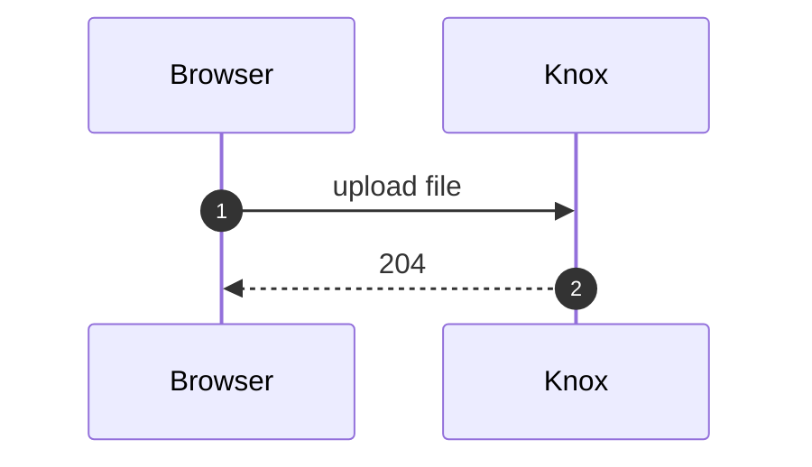

# Lunchables

A slide deck app for talks with live demos. Slides are Markdown files that can embed Svelte components, so a slide can show a code snippet and run that same feature right below it. The first deck is "Lunchable: Install Nothing", a 20 minute talk on native browser APIs (dialog, popover, view transitions, anchor positioning, exclusive accordions and more). Other decks cover image moderation (NSFW) and working with Claude Code (Vibe with Claude).

Built with Svelte 5, SvelteKit (remote functions, prerendering), mdsvex, Shiki and Tailwind CSS 4.

## Getting started

The project uses [bun](https://bun.sh).

```bash
bun install
bun run dev        # http://localhost:5173, the overview of all presentations
```

| Command                    | What it does                               |
| -------------------------- | ------------------------------------------ |
| `bun run dev`              | Start the dev server                       |
| `bun run build`            | Build and prerender every deck             |
| `bun run preview`          | Serve the production build                 |
| `bun run check`            | Type check with svelte-check               |
| `bun run lint`             | Prettier and ESLint                        |
| `bun run format`           | Format everything with Prettier            |
| `bun run new`              | Create a deck, slide or theme (asks which) |
| `bun run new deck`         | Create a new presentation                  |
| `bun run new slide [deck]` | Add a slide to a presentation              |
| `bun run new theme [deck]` | Pick or replace a presentation's theme     |

## Project layout

```
src/
  presentations/
    install-nothing/          one folder per deck, the folder name is the URL
      config.ts               title, description, cover
      theme.ts                colors for this deck (see Themes)
      slides/*.md             the slides
      components/             components only this deck uses (demos, ShipScore)
      assets/                 images only this deck uses
  lib/
    presentations.ts          finds every deck's config.ts and theme.ts, sorts them newest first
    slides.remote.ts          getSlides(deck), a prerendered remote function
    slides.ts                 previous/next/counter logic
    themes.ts                 theme presets and themeStyle()
    types.ts                  Slide and PresentationConfig
    components/SlideFooter.svelte
    components/Cover.svelte   cover markup, used by the cover page and the previews
    components/CoverPreview.svelte   scaled-down live cover for the home grid
    components/PresentationCard.svelte, HomeLink.svelte
    components/custom/        Markdown element overrides, shared by all decks
  routes/
    +page.svelte              / overview: a grid of every presentation
    [deck]/+page.svelte       deck cover
    [deck]/+layout.svelte     keyboard navigation and footer
    [deck]/[slug]/            a single slide
    mdsvex.svelte             Markdown layout, registers the custom elements
```

## Adding a presentation

Run `bun run new deck` and answer the prompts:

| Prompt           | Default               | Notes                                                                                              |
| ---------------- | --------------------- | -------------------------------------------------------------------------------------------------- |
| Title            | none                  | Required                                                                                           |
| Folder / URL     | the title in URL form | Lowercase letters, numbers and dashes. Must not exist yet or match a route in `src/routes`         |
| Description      | empty                 | Becomes the cover's meta description                                                               |
| Author           | your git user name    | Shown on the home page card only. Leave empty to omit                                              |
| Cover heading    | the title             |                                                                                                    |
| Cover image path | none                  | Type, paste or drag a file into the terminal. It is copied to `assets/cover.<ext>`. Enter skips it |
| Theme            | `midnight`            | A preset, or `custom` for a theme file with every color to edit. See [Themes](#themes)             |

Defaults show as grey placeholder text; press Enter to accept one or type over it. Lists use the arrow keys and Enter. If an answer isn't valid, the reason shows under the field and you can fix it in place. Ctrl+C stops without writing the deck or slide you were working on.

The script creates `config.ts`, `theme.ts`, a first slide at `slides/1intro.md` and, if you gave an image, `assets/cover.<ext>`. Run `bun run dev` and open `/<folder>`.

### By hand

The script only writes files, so you can also create them yourself:

1. Create a folder under `src/presentations/`. The folder name becomes the URL, so use something like `my-talk` to get `/my-talk`.
2. Add `config.ts`:

   ```ts
   import type { PresentationConfig } from '$lib/types';
   import cover from './assets/cover.svg';

   export default {
   	title: 'My talk',
   	description: 'Shown as the meta description of the cover page',
   	date: '2026-10-01', // YYYY-MM-DD, the home page lists newest first
   	author: 'Your name', // optional, home page card only
   	cover: {
   		image: cover, // optional
   		alt: 'My talk logo', // optional, falls back to the title
   		heading: 'Big heading on the cover'
   	}
   } satisfies PresentationConfig;
   ```

3. Optionally add `theme.ts` (see [Themes](#themes)). Without one the deck uses `midnight`.
4. Add slides to `slides/` (see the next section).
5. Open `/my-talk`.

That's it. The registry, the routes, the home page and the build all pick up the new folder on their own. `bun run new deck` sets `date` to today; change it if you want the deck sorted by the day you give the talk.

If the cover has no `image`, the heading links to the first slide instead.

## Themes

Each deck sets its colors in `theme.ts`. `bun run new deck` asks for one, and `bun run new theme [deck]` changes it later (it asks before replacing an existing file).

A preset is one line:

```ts
import type { Theme } from '$lib/themes';

export default 'ocean' satisfies Theme;
```

| Preset     | Background | Accent     |
| ---------- | ---------- | ---------- |
| `midnight` | gray-950   | yellow-400 |
| `paper`    | stone-50   | red-600    |
| `ocean`    | slate-950  | sky-400    |

Pick `custom` to get every color written out, starting from `midnight`:

```ts
import type { Theme } from '$lib/themes';

export default {
	surface: 'gray-950', // background
	ink: 'gray-100', // text
	accent: 'yellow-400', // titles, card hover, current slide in the picker
	onAccent: 'gray-950', // text on accent backgrounds
	highlight: 'teal-300' // wavy underline under _emphasis_
} satisfies Theme;
```

Values take a Tailwind color name (`'pink-500'`, `'white'`) or any CSS color (`'#ff3366'`, `'oklch(0.7 0.2 20)'`).

The theme sets CSS variables on the deck's `<main>`, so it only applies inside that deck and to its card preview on the home page. The home page itself always uses `midnight`. Muted text, borders and hover states are `ink` at reduced opacity (`text-ink/60`, `border-ink/15`), which keeps the footer readable on light and dark themes without drawing attention.

In your own components, use the token classes (`bg-surface`, `text-ink`, `text-accent`, `text-on-accent`, `decoration-highlight`) to follow the deck's theme. To add a preset, add it to `themes` in [src/lib/themes.ts](src/lib/themes.ts); the CLI lists it automatically.

Code blocks don't follow the theme. Shiki colors them at build time with `github-dark`.

## Home page

`/` shows every presentation as a card, newest `date` first. Each card shows a live, scaled-down render of the deck's cover (the real cover component, not a screenshot), then the title, description, and a line with the author, date and slide count. The author appears only here, never on the cover or the slides. Click a card to open its cover: the preview zooms into the full cover with a view transition, and going back shrinks it into its card again. With reduced motion turned on in the OS, all view transitions are skipped.

## Adding a slide

Run `bun run new slide` (or `bun run new slide my-talk` to skip picking the deck). It shows the deck's last slide, then asks:

| Prompt       | Default                                 | Notes                                                                       |
| ------------ | --------------------------------------- | --------------------------------------------------------------------------- |
| Presentation | the only deck, or a list to pick from   | Skipped when you pass the deck name                                         |
| Position     | At the end                              | `At the end` or `Before <slide>`. Each option says how many slides it moves |
| Slide type   | the type of the slide before it         | `content`, `demo`, `ship`, `split` or `code`                                |
| Title        | the title of the slide before it        | Slides in one section share a title                                         |
| Subtitle     | empty                                   | Only asked for `demo` and `ship`                                            |
| File name    | order + subtitle (or title) in URL form | Becomes the slide's URL. Must not exist yet                                 |

The new file gets the frontmatter plus a starter body for its type:

- `content`: two placeholder bullets
- `demo`: a commented-out component import and an empty `html` code block
- `ship`: a `ShipScore` with empty versions, if the deck has `components/ShipScore.svelte`. Otherwise a note on where to copy it from
- `split`: two columns, text on the left and a commented-out component on the right
- `code`: no body

After each slide the script asks "Add another slide?", and `bun run new deck` asks the same once the deck exists.

### Inserting between slides

Pick `Before <slide>` to put the new slide in front of an existing one. It gets the order right after the previous slide. If that number is taken, the slides after it each move up by one: the `order` in their frontmatter changes, and a file name that starts with the old number gets the new one (`10modals_vt_ship.md` becomes `11modals_vt_ship.md`, so its URL changes too). Shifting stops at the first free number, so slides past a gap stay where they are. In install-nothing, 34 to 49 are free, so a slide inserted before `50end` moves nothing.

The summary lists every moved slide. Files only change after the last question, so Ctrl+C leaves the deck untouched.

## Writing slides

Each slide is a Markdown file in the deck's `slides/` folder. The file name is the slide's URL (`intro.md` becomes `/my-talk/intro`), and frontmatter sets the rest:

```md
---
title: Modals x Alerts x Dialogs
subtitle: Basic Modal
type: 'demo'
order: 6
---
```

| Field      | Required | Meaning                                                                                                     |
| ---------- | -------- | ----------------------------------------------------------------------------------------------------------- |
| `title`    | yes      | Slide title, also the browser tab title                                                                     |
| `subtitle` | no       | Big accent-colored heading on `demo` and `ship` slides, shown in the slide picker                           |
| `type`     | yes      | `content`, `demo`, `ship`, `split` or `code` (layouts below)                                                |
| `size`     | no       | `compact` shrinks prose and lists to small text, for slides with a lot of text                              |
| `order`    | yes      | Position in the deck. Slides are sorted by this number, not by file name, so give each slide a unique value |

### Slide types

- **`content`**: large italic title in the accent color with the Markdown body below it in large prose. Use it for bullet lists and text.
- **`demo`**: small title, big subtitle, and the body inside a bordered, scrollable box. Use it for a live demo with its code.
- **`ship`**: like `demo` without the border. Meant for the ship score component.
- **`split`**: medium italic title in the accent color, then the body fills the rest of the screen without scrolling. Write the body as HTML with two columns, text on the left and a component (a code panel, an image) on the right.
- **`code`**: shows only `title | code`. The Markdown body is not rendered for this type.

### Components in slides

Import components in a `<script>` block and use them like in any Svelte file:

```md
<script>
  import BasicDialog from '../components/BasicModal.svelte'
</script>

<BasicDialog />
```

Components used by one deck go in that deck's `components/` folder and are imported with a relative path. Shared components go in `src/lib` and are imported with `$lib/...`.

### Code blocks

Fenced code blocks are highlighted at build time with Shiki's `github-dark` theme and get line numbers. Code renders in JetBrains Mono with ligatures, so `!==` and `=>` show as single glyphs.

Only `html`, `css`, `javascript` and `go` are loaded. Any other language renders as plain text. To add one, extend `langs` in [svelte.config.js](svelte.config.js).

### Diagrams

Write a [Mermaid](https://mermaid.js.org/intro/) diagram as a `mermaid` code block in any slide. No import needed:

````md

````

The diagram renders in the browser when the slide opens and takes its colors from the deck's theme (`ink` for lines and text, `accent` for borders, `highlight` for notes). It scales to the width of the slide, up to 62% of the screen height. The code lives in [src/lib/mermaid.ts](src/lib/mermaid.ts); Mermaid is only downloaded on slides that have a diagram.

To highlight steps in a sequence diagram, wrap them in a `rect` block, for example `rect rgba(239, 68, 68, 0.25)`.

### Markdown styling

[src/routes/mdsvex.svelte](src/routes/mdsvex.svelte) replaces some Markdown elements with custom components from `src/lib/components/custom/`, for every deck:

| Markdown       | Renders as                                                                |
| -------------- | ------------------------------------------------------------------------- |
| `_text_`       | Non-italic text with a wavy underline in the highlight color              |
| `- item` lists | Large text (`text-5xl`) with a 🗴 marker, `text-sm` with `size: 'compact'` |
| ``  | `` with `loading="lazy"`                                             |
| Code blocks    | `<pre>` at 95% width                                                      |

### Images

Import images instead of linking them by path, so Vite bundles them and the URL works under any deck prefix:

```md
<script>
  import grid from '../assets/grid.png'
</script>


```

Files in `static/` are served from `/` and work with an absolute path (`/favicon.png`), but they aren't tied to a deck.

### Ship score

`ShipScore` (in the install-nothing deck) shows a "ship score" button. Clicking it reveals a verdict, the browser versions that support the feature, and optional extra labels:

```svelte
<ShipScore chrome="37" firefox="98" safari="15.4" globalScore="95%!" shipIt inUse />
```

| Prop                          | Meaning                                                               |
| ----------------------------- | --------------------------------------------------------------------- |
| `chrome`, `firefox`, `safari` | First supported version. Leave one out and that browser shows a red X |
| `shipIt`, `tryIt`, `checkIt`  | Verdict, checked in that order: SHIP IT, TRY IT or CHECK IT           |
| `globalScore`                 | Large global usage figure, e.g. `"95%!"`                              |
| `inUse`                       | Shows "used in VUE-UI"                                                |

## Presenting

| Key            | Action                                                                                         |
| -------------- | ---------------------------------------------------------------------------------------------- |
| `→` or `Space` | Next slide. On the cover this opens the first slide, on the last slide it returns to the cover |
| `←`            | Previous slide. On the first slide it returns to the cover, on the cover it does nothing       |
| `H`            | Home page                                                                                      |
| `R`            | Back to the cover, to start over                                                               |

The shortcuts ignore keys pressed with Ctrl, Cmd or Alt, so Ctrl+R still reloads the page. They also ignore keys typed into a demo's input fields.

The footer on every slide has a grid icon that opens the home page, Previous, a counter (`6 / 34`) and Next. The cover has the same grid icon in its top-left corner. On the last slide Next becomes a reload icon that links back to the cover. Clicking the counter opens a list of every slide, with the current one highlighted. Pick a slide to jump to it.

Page changes animate with the View Transitions API in browsers that support it. The slide, the title and the footer each have their own transition name.

Most demos rely on recent APIs (popover, anchor positioning, `@starting-style`, view transitions), so present from an up-to-date Chrome.

## Build and deploy

Every page is prerendered. `bun run build` writes static HTML for `/`, each deck cover, every slide, plus the result of `getSlides` for each deck. The project uses `@sveltejs/adapter-auto`. To deploy as a plain static site, swap it for `@sveltejs/adapter-static`.
