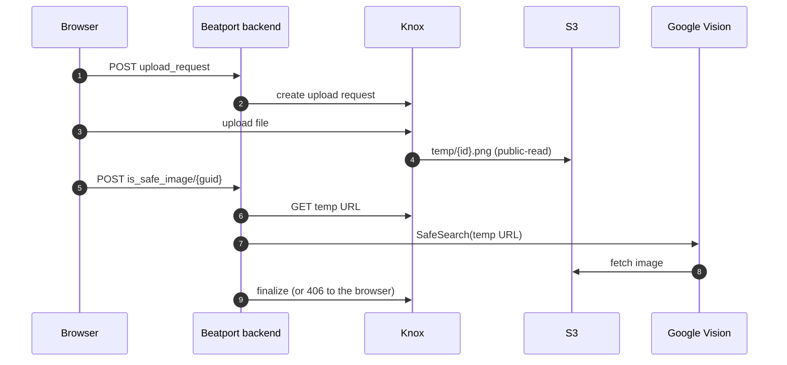

```mermaid
sequenceDiagram
	autonumber
	participant B as Browser
	participant BP as Beatport backend
	participant K as Knox
	participant S3
	participant V as Google Vision
	B->>BP: POST upload_request
	BP->>K: create upload request
	B->>K: upload file
	K->>S3: temp/{id}.png (public-read)
	B->>BP: POST is_safe_image/{guid}
	BP->>K: GET temp URL
	BP->>V: SafeSearch(temp URL)
	V->>S3: fetch image
	BP->>K: finalize (or 406 to the browser)
```
