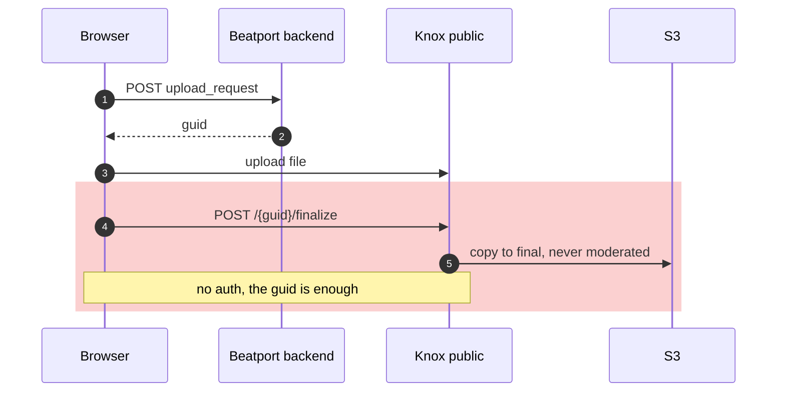

```mermaid
sequenceDiagram
	autonumber
	participant B as Browser
	participant BP as Beatport backend
	participant K as Knox public
	participant S3
	B->>BP: POST upload_request
	BP-->>B: guid
	B->>K: upload file
	rect rgba(239, 68, 68, 0.25)
		B->>K: POST /{guid}/finalize
		K->>S3: copy to final, never moderated
		Note over B,K: no auth, the guid is enough
	end
```

	Knox public exposes finalize without auth. The guid is enough. 
	<code>is_safe_image</code> also never checks that the guid belongs to the event.

