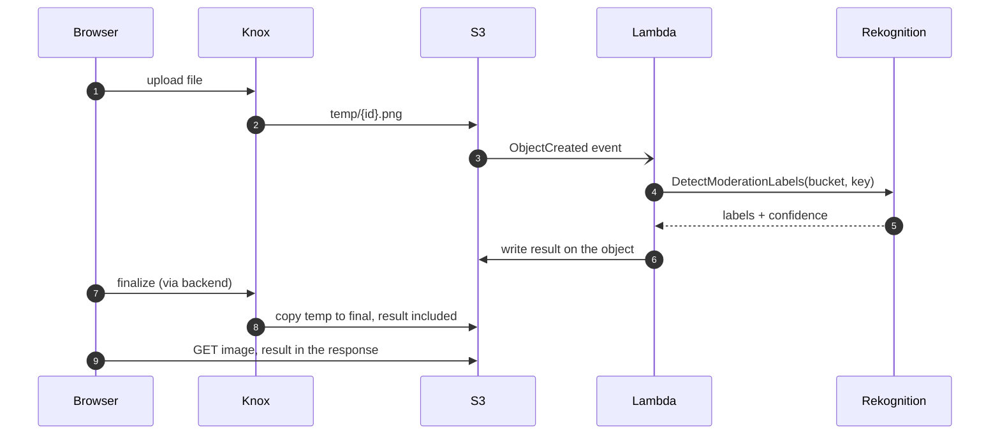

```mermaid
sequenceDiagram
	autonumber
	participant B as Browser
	participant K as Knox
	participant S3
	participant L as Lambda
	participant R as Rekognition
	B->>K: upload file
	K->>S3: temp/{id}.png
	S3-)L: ObjectCreated event
	L->>R: DetectModerationLabels(bucket, key)
	R-->>L: labels + confidence
	L->>S3: write result on the object
	B->>K: finalize (via backend)
	K->>S3: copy temp to final, result included
	B->>S3: GET image, result in the response
```
