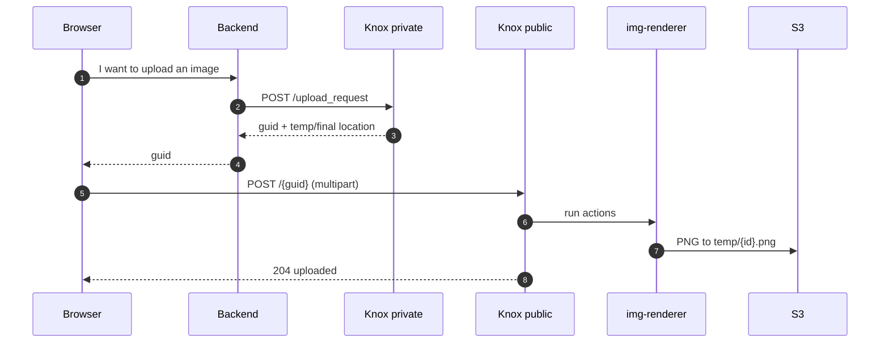

```mermaid
sequenceDiagram
	autonumber
	participant B as Browser
	participant BE as Backend
	participant KP as Knox private
	participant KU as Knox public
	participant R as img-renderer
	participant S3
	B->>BE: I want to upload an image
	BE->>KP: POST /upload_request
	KP-->>BE: guid + temp/final location
	BE-->>B: guid
	B->>KU: POST /{guid} (multipart)
	KU->>R: run actions
	R->>S3: PNG to temp/{id}.png
	KU-->>B: 204 uploaded
```
